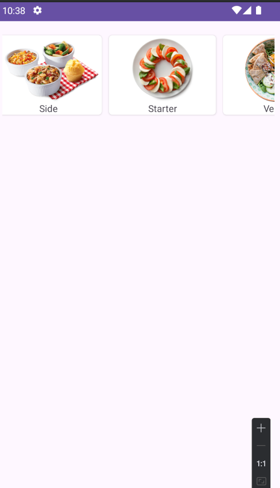

# Food Category App - Lập trình Mobile

Một dự án Android đơn giản minh họa các kỹ thuật hiện đại trong phát triển ứng dụng di động, bao gồm kết nối API, xử lý dữ liệu JSON và hiển thị danh sách động.

## Ảnh chụp màn hình

<p align="center">
    
</p>

## ✨ Tính năng chính

-   **Gọi API bất đồng bộ:** Lấy danh sách danh mục món ăn từ máy chủ bằng Retrofit.
-   **Hiển thị danh sách ngang:** Sử dụng `RecyclerView` với `LinearLayoutManager` để tạo danh sách cuộn ngang mượt mà.
-   **Tải và cache hình ảnh:** Tự động tải ảnh từ URL và lưu vào bộ nhớ đệm với Glide để tối ưu hiệu năng.
-   **Mô hình hóa dữ liệu:** Chuyển đổi dữ liệu JSON từ API thành các đối tượng Java/Kotlin bằng GSON.
-   **Thiết kế giao diện hiện đại:** Sử dụng `CardView` và `ConstraintLayout` để tạo giao diện người dùng linh hoạt và hấp dẫn.

## 🛠️ Công nghệ & Thư viện

| Thư viện                                        | Phiên bản | Chức năng        |
| ----------------------------------------------- | :--------: | ---------------- |
| [Retrofit](https://square.github.io/retrofit/)  |  `2.9.0`   | Networking       |
| [GSON](https://github.com/google/gson)          |  `2.9.0`   | JSON Parsing     |
| [Glide](https://github.com/bumptech/glide)      |  `4.14.2`  | Image Loading    |
| [RecyclerView](https://developer.android.com/guide/topics/ui/layout/recyclerview) |      -     | Hiển thị danh sách |
| [CardView](https://developer.android.com/guide/topics/ui/layout/cardview)           |      -     | UI Component     |

## 🔌 Thông tin API

Dự án sử dụng một API công khai để lấy dữ liệu danh mục:

-   **Base URL:** `http://app.iotstar.vn:8081/appfoods/`
-   **Endpoint:** `categories.php`
-   **Method:** `GET`

## 📁 Cấu trúc Project

Dự án được tổ chức theo kiến trúc MVVM (Model-View-ViewModel) khuyến nghị:

```
com.example.baitap5
│
├── 📂 model
│   └── 📄 Category.java        # (Model) Đối tượng dữ liệu cho danh mục
│
├── 📂 api
│   ├── 📄 RetrofitClient.java  # (Networking) Cấu hình Retrofit (Singleton)
│   └── 📄 APIService.java      # (Networking) Interface định nghĩa các endpoint
│
├── 📂 adapter
│   └── 📄 CategoryAdapter.java # (View) Adapter cho RecyclerView
│
└── 📄 MainActivity.java        # (View/Controller) Màn hình chính
```

## 🚀 Cài đặt và Chạy dự án

1.  **Clone a repository:**
    ```bash
    git clone <your-repository-url>
    ```
2.  **Mở dự án trong Android Studio.**
3.  **Build và chạy ứng dụng.**

Android Studio sẽ tự động tải về các thư viện cần thiết thông qua Gradle.
